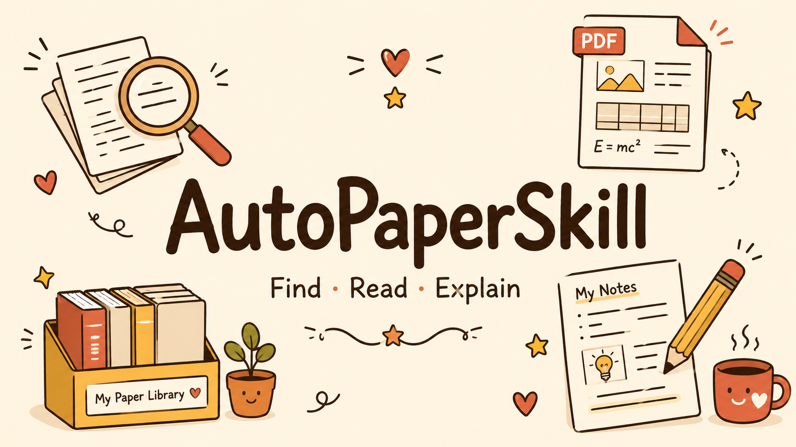

# AutoPaperSkill

<p align="center">
  
</p>

`AutoPaperSkill` is an AI-agent skill for research-paper discovery, deduplication, local storage, browsable library indexing, and deep paper analysis.

It is designed for conversation-first use in agent harnesses such as Codex or Claude Code. Helper scripts handle deterministic tasks such as paper storage, PDF parsing, metadata merging, LaTeX formatting, and PDF compilation; the active agent remains responsible for external lookup, reading the evidence, deciding the narrative, and writing the report content.

External paper and author lookup is intentionally an agent action, not a script action. The active agent should use the web/search/MCP tools available in the conversation to inspect OpenReview, Semantic Scholar, Crossref, arXiv, official venue pages, or publisher pages, then save only the relevant source evidence for local merging and reporting.

## What It Does

The skill supports three primary modes:

- `Research direction`: find new papers for a topic, compare them against a local paper library, and keep only non-duplicates.
- `Conference or journal`: collect papers from a venue across one or more years, preferring official sources.
- `Specific papers`: resolve one or more papers by DOI, arXiv ID, or title.

For deep analysis, the skill requires a local PDF and then:

- parses the paper PDF for text, figures, tables, equations, and proof-related evidence
- saves extracted visual assets into `images/`
- enriches metadata across sources instead of stopping at the PDF source
- has the active agent write a Chinese-first, narrative-style report from the full evidence bundle
- compiles the LaTeX report into `report.pdf`
- maintains a generated `papers.html` index at the library root for browsing saved papers by venue

## Current Analysis Behavior

The current version is optimized for evidence-grounded paper reports rather than light summaries.

- Final report narration is Chinese by default.
- `英文摘要原文` is preserved verbatim.
- `中文摘要` is intended to be a faithful direct translation of the English abstract, not a free-form summary.
- Figures and tables are parsed by Docling as structured document objects first, then exported into `images/`.
- Docling image export uses a higher default scale than the package default so extracted figures and tables are sharper; rerun `pdf_analyzer.py` with `--image-scale <value>` if a paper still needs higher-resolution assets.
- Figures, tables, and equations must be embedded into the story line where they explain the method, experiment, or proof instead of being isolated as separate blocks.
- Report drafting is reader-first: the active agent should plan the reader's next question, the answer being built, and the evidence needed before writing the main narrative.
- The renderer no longer fabricates the main analysis from legacy fields. If `analysis.narrative_sections` is missing, it emits a placeholder telling the agent to write the narrative first.
- The renderer does not print `lead_in_zh` or `takeaway_zh` as report body. Evidence blocks must be surrounded by agent-written paragraphs that integrate the figure/table/formula with the surrounding argument.
- Equations keep their original mathematical expressions and are rendered as LaTeX math when `latex_expression` is available or can be converted safely.
- If OpenReview exposes a PDF resource, the skill should use that PDF instead of silently falling back to arXiv.
- OpenReview PDF priority does not stop metadata enrichment: the skill still tries DOI/arXiv/citation/author-impact metadata through sources such as Semantic Scholar, Crossref, and arXiv.
- Networked discovery and metadata enrichment must be performed by the active agent through conversation-available tools. Bundled scripts must not fetch external paper metadata; they may only merge or render local evidence that the agent already collected.
- The PDF parser is the standard local `docling` pipeline only. This repository does not require `docling[vlm]`, remote VLM services, or separate large-model deployment.

## Output Layout

Each saved paper bundle is expected to live under:

```text
<save_root>/<paper_id>/
```

Typical contents:

- `paper.pdf`
- `metadata.json`
- `pdf_analysis.json`
- `analysis.json`
- `images/`
- `sources/`
- `report.tex`
- `report.pdf`

The bundle directory is the only durable output location for a saved paper. Temporary downloads or drafts may be used while working, but final artifacts must be moved into the canonical bundle paths returned by `scripts/paper_store.py upsert` or `scripts/paper_store.py layout`.

The library root also has a generated `papers.html` file. It groups papers by conference or journal name with years and presentation suffixes stripped from the group heading, and it opens local PDFs in a right-side preview pane instead of making report links download files. It is refreshed automatically after `paper_store.py upsert` and after `render_report.py` completes for a canonical bundle. To rebuild it manually:

```bash
python3 skills/auto-paper-skill/scripts/paper_store.py refresh-index \
  --library-dir /path/to/paper-library
```

Do not use `/tmp` as the durable paper library. `paper_store.py` refuses temporary library roots by default, because `/tmp` should only hold downloads, parser scratch files, and drafts.

Set a stable default library once:

```bash
python3 skills/auto-paper-skill/scripts/paper_store.py config set-library \
  --library-dir /path/to/paper-library
```

After that, storage commands can omit `--library-dir`; the script resolves the library root from `AUTOPAPER_LIBRARY_DIR` first, then `~/.config/autopaper-skill/config.json`.

## Report Contract

New reports must use agent-authored `analysis.json` fields `narrative_plan`, `narrative_sections`, `evidence_blocks`, `author_analysis`, and `key_equations[].latex_expression`.

`narrative_sections[].blocks` should interleave explanation and evidence in order: integrated paragraph, immediately relevant figure/table/formula, then another integrated paragraph that interprets the evidence and continues the argument. Legacy fields such as `method_flow`, `key_figures`, `key_tables`, and `key_equations` are evidence pools for the agent to consult, not a substitute for a written report.

Evidence placement hints such as `placement_hint_zh` or legacy `lead_in_zh` may be kept in `analysis.json` for planning, but they are not rendered. The rendered text before and after a figure/table/formula must be fresh agent-written prose that combines the evidence content with the current context.

The paragraph immediately before evidence must prepare the reader before naming the evidence. For example, define `P(True)`, Self-Consistency, SSC, the datasets, and ECE before inserting a CaTS calibration table; do not jump straight from the problem statement to `表 1 把...`.

`narrative_plan` is the drafting scaffold, not a rendered section. Use it to decide what a reader needs to understand next, which evidence answers that question, and whether experiments, theory, figures, tables, or formulas deserve slow explanation or only concise mention.

Inline math in the narrative, such as `\hat{c}`, `S(h,\hat{c})`, `M_phi`, and `\lambda`, is rendered as math when it is safe instead of being escaped as plain LaTeX text.

## Install

The installable Codex skill in this repository lives under:

`skills/auto-paper-skill`

Install it from GitHub with:

```bash
python3 ~/.codex/skills/.system/skill-installer/scripts/install-skill-from-github.py \
  --repo Zachary709/AutoPaperSkill \
  --path skills/auto-paper-skill
```

## Repository Layout

- `skills/auto-paper-skill`: the installable skill
- `tests`: repository-side tests for helper scripts and rendering behavior
- repository root: development metadata and documentation

The repository root is for development assets such as tests and repository metadata. The skill installer should target the subdirectory above, not the repo root.
